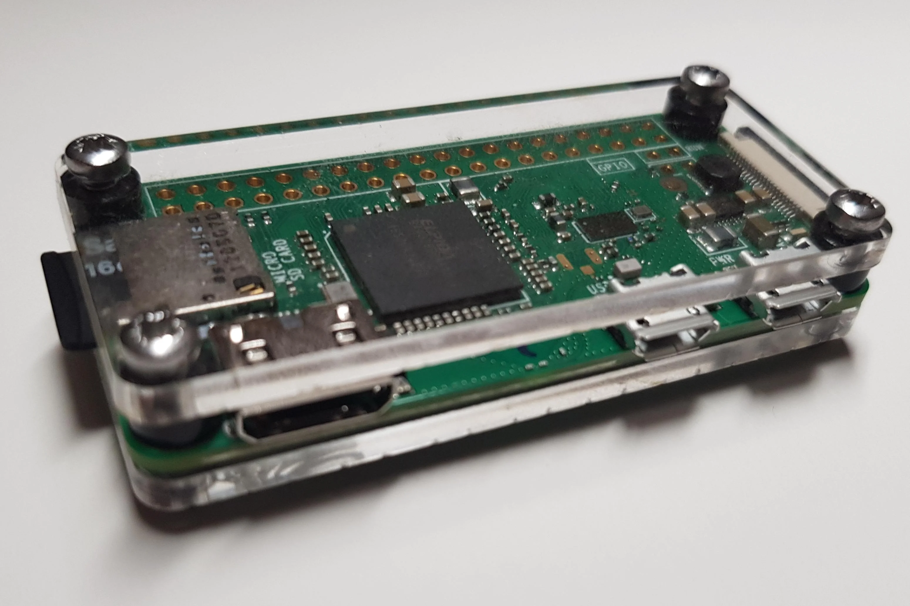

# My Raspberry Pi Setup
My raspberry Pi setup - self-hosting



## Table of contents

- [My Raspberry Pi Setup](#my-raspberry-pi-setup)
  - [Table of contents](#table-of-contents)
  - [Sources](#sources)
  - [RBenv](#rbenv)
    - [B](#B)

## Sources

- [reactnative.dev](https://reactnative.dev/docs/environment-setup)

- [React Native TS + Navigation v6](https://youtu.be/UzMbu3XKEoM)

## RBenv

Rbenv is a version manager tool for the Ruby programming language on Unix-like systems

* RBenv Installation

```bash
sudo apt-get install rbenv
echo 'export PATH="$HOME/.rbenv/bin:$PATH"' >> .bashrc
echo 'eval "$(rbenv init -)"' >> .bashrc
```

* Update your terminal

```
source .bashrc
```

* Test your installation

```
rbenv
> rbenv x.x.x #version to be displayed
```
